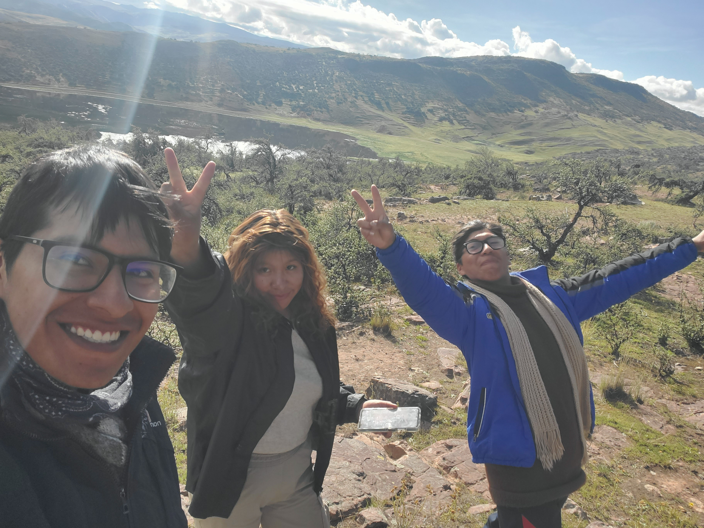

# Max Peter Panca jevera (BioMax1.0) 🥾🌿

---
layout: default
title: Inicio
---

[Inicio](./) | [Trayectoria](./trayectoria) | [Proyectos](./proyectos) | [Publicaciones](./publicaciones)

---

¡Hola! Soy Max Peter Panca Jevera. Soy biólogo e investigador, pero sobre todo, un apasionado por entender cómo funciona la vida en los ecosistemas más extremos.

## 🏔️ De los Andes para el Mundo
Mi aventura comenzó en la **Universidad Nacional del Altiplano**, donde descubrí mi fascinación por las interacciones biológicas y la ecología de perturbaciones utilizando comunidades vegetales. Desde entonces, mi trayectoria me ha llevado a:

* **Texas, USA:** Investigando el funcionamiento de los ecosistemas biológicos *The Wolf Lab*. 
* **Marburg, Alemania (virtual):** Sumergiéndome en la ecoinformática y los datos neotropicales.
* **Puno, Perú:** Conservando semillas que son el futuro de nuestra biodiversidad y estudiando incendios. 

---

## 🎓 Trayectoria en breve
Si estás aquí por mi perfil profesional, puedes ver mis hitos principales:
- **Investigador Visitante** - UT Austin (2025)
- **Asistente de Investigación** - Proyecto CONTINENT (2026)

---
> "La ciencia no solo se hace en el laboratorio, se vive en cada paso del camino."

### Mis redes y contacto:
[🔗 LinkedIn](https://www.linkedin.com/in/max-peter-panca-jevera-0631b5211/) | [✉️ Correo](maxpeterpancajevera1234@gmail.com) | [📚 ResearchGate](https://www.researchgate.net/profile/Max_Peter_Panca_Jevera?ev=hdr_xprf)
