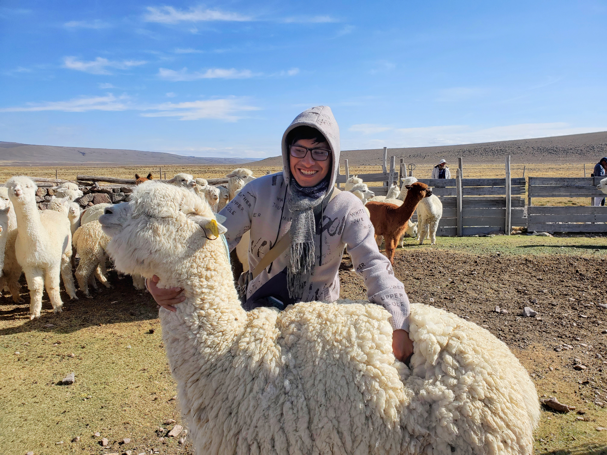

[Inicio](./) | [Trayectoria](./trayectoria) | [Proyectos](./proyectos) | [Publicaciones](./publicaciones)

---

# UN POCO SOBRE MI
##Universidad
Empecé mis estudios en la Unversidad Nacional del Altiplano Puno, estudié biología con mención en ecología en la Facultad de Ciencias Biológicas. Desde ahí me dedique a mis estudios y gracias a ello pude ser beneficiario de multiples becas como la BECA PERMANENCIA DE PRONABEC  

---
#DESCOSUR
##Investigación en ecosistemas de alta montaña
Durante mi ultimo año de carrera (2023), fuí seleccinado para participar en la primera edición de la Diplomatura de Gestión y Manejo de Ecosistemas de Alta Montaña organizado por DESCOSUR en colaboración con la Universidad Nacional Agraria La Molina (UNALM). 

#SPDA
##Taller de derecho ambiental
En el año 2024 fuí seleccionado para participar virtualmente en 23th taller de derecho ambiental organizado por la Sociedad Peruana de Derecho Ambiental (SPDA)

#REPU
##ECORepu
En el año 2023 fuí seleccionado para realizar una pasantia a travéz del programa EcoREPU en el Wolf Lab de la Universidad de Texas en Austin (USA) 

